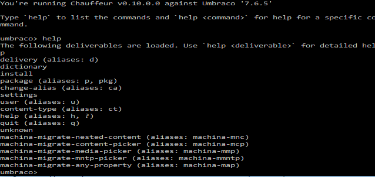

# Machina

An Umbraco Chauffeur extension to run one-time (or as needed) utilities on your Umbraco sites.

## Property Editor Migrations

Migrate from Property Editors from the old non-UDI to the new UDI format.

**PLEASE BACKUP YOUR DATABASE FIRST**

To use you will need to do the following:

1) Install [Chauffeur.Runner](https://www.nuget.org/packages/Chauffeur.Runner/0.9.0) (recommended to use v0.9.0) to your web project. This will allow you to execute these scripts from the command line.
2) Make sure the `Machina.dll` is in you web `/bin` folder. (Will have a Nuget install at some point).
3) Start the runner by executing `~/bin/Chauffeur.Runner.exe`
4) Type `help` and press `ENTER`. This will show you the commands you can run.

**You should read the rest of this before proceeding (including FAQ's)!**

To run a command, type the command name and press `ENTER`. For instance to run the `migrate content picker` command, type `mcp` and press `ENTER`.

This will provide you preview output against your database. At this time you see if the proposed changes seem legit.

You'll likely get no output because you probably haven't changed your `ContentPicker` to `ContentPicker2`.

Log into Umbraco, change any datatype using `Umbraco.ContentPicker` to `Umbraco.ContentPicker2` and save.

Now re-run the preview (i.e. `mcp <ENTER>`).

If you're happy with the results and want to alter the DB, type `mcp 1 <ENTER>`.

At this point your site will be broken if you visit it. It's because the underlying content has been updated in the DB but the frontend is operating off the cache values.

These cache values are used in the `Umbraco.ContentPicker2` property value converter and will throw an exception.

To fix publish all of your nodes. You can do so by right-clicking the root level items (one at a time) and selecting 'Publish'. This isn't the same as 'Republish Entire Site' which is available at the top.

**BACKUP YOUR DB IN CASE IT GOES WRONG. PRACTICE LOCALLY BEFORE ATTEMPTING ON PROD!**

## FAQ

**Where do I get the `Machina.dll`?**
Right now you'll clone this repo and build it. I hope to have some prebuilt releases soon and even better, a Nuget package.

**What about xyz property type?**
There are a few other property types not covered in the migration scripts. Those are `Folder Browser` and `Related Links`. Send me a PR.

**What about Archetype and Nested Content?**
Archetype and Nested Content are a bit tougher since they are saving data differently and now this change pulls the rug out from them. At this time I haven't written converters for those. So don't change any items bundled into Nested Content\Archetype just yet. It'll just be pain for you.
